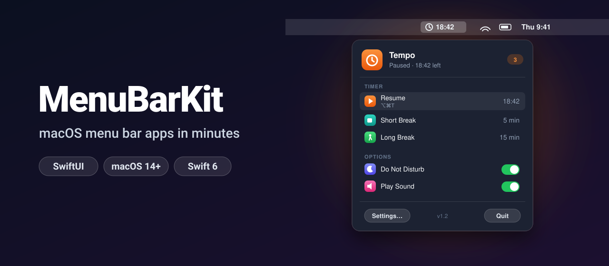
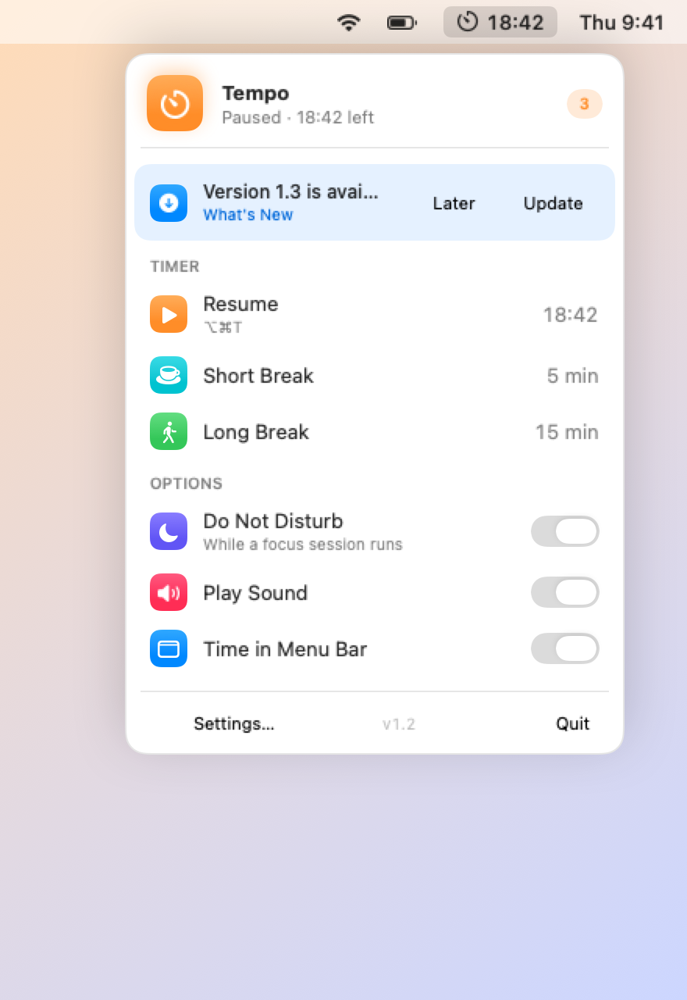
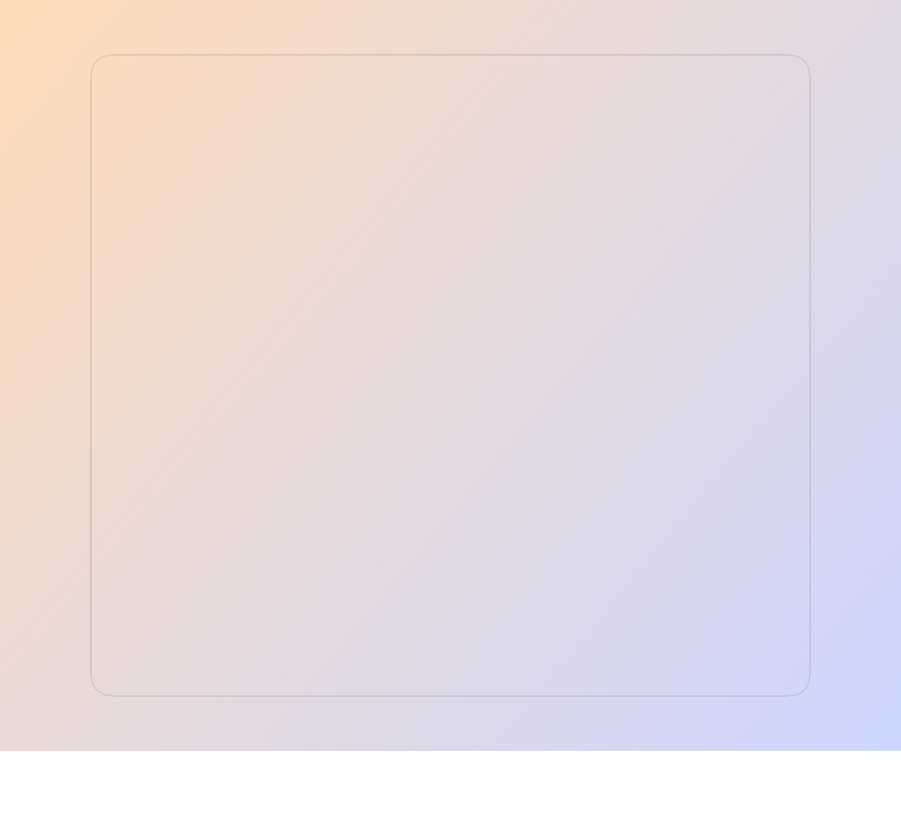
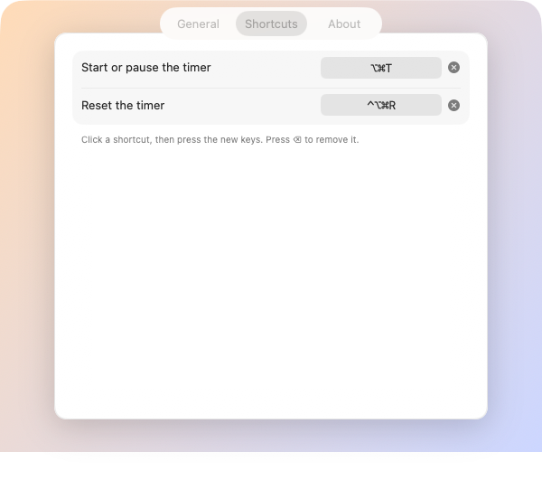
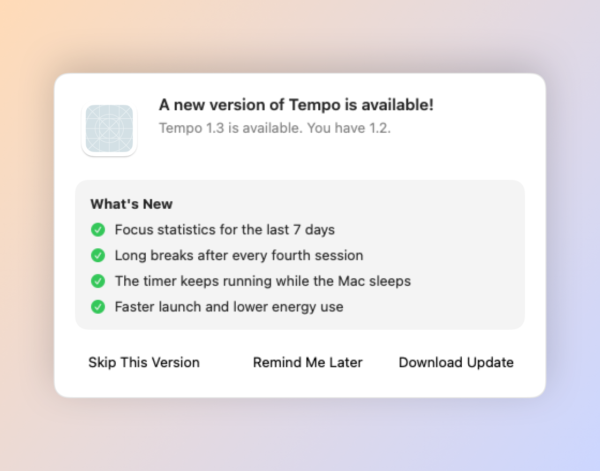

<p align="center">
  
</p>

<p align="center">
  <a href="https://github.com/halilozel1903/MenuBarKit/actions/workflows/ci.yml"></a>
  
  
  
  <a href="LICENSE"></a>
</p>

**MenuBarKit** has the parts every macOS menu bar app needs, so you can write the part that is yours: a **menu bar window** with a header, sections, rows and a Settings/Quit footer, a **settings window** with General, Shortcuts and About tabs, **Open at Login**, a **global keyboard shortcut** the user can change, and an **update prompt** fed by a JSON file. Buttons use Liquid Glass on macOS 26; everything runs on macOS 14.

```swift
@main
struct TempoApp: App {
    var body: some Scene {
        MenuBarApp("Tempo", systemImage: "timer", statusTitle: "18:42") {
            MenuBarPanel("Tempo", subtitle: "Paused · 18:42 left", systemImage: "timer", tint: .orange) {
                MenuBarSection("Timer") {
                    MenuBarRow("Resume", systemImage: "play.fill", tint: .orange, value: "18:42") { … }
                }
            }
        }
        Settings {
            SettingsPane { Toggle("Play a sound", isOn: $playsSound) }
        }
    }
}
```

## Screenshots

Rendered from the example app on macOS 26 by CI.

| Menu bar panel | Settings |
| :---: | :---: |
|  |  |

| Global shortcuts | Update prompt |
| :---: | :---: |
|  |  |

## Features

- **Menu bar scene** (`MenuBarApp`): `MenuBarExtra` with the `.window` style, an SF Symbol plus optional short text such as a countdown, and an optional `isInserted` binding.
- **Panel scaffold** (`MenuBarPanel`): a header with an icon tile, a title, a status line and an accessory; `MenuBarSection`s of `MenuBarRow`s (icon, title, subtitle, value, hover highlight) and `MenuBarToggleRow`s (a switch); a footer with Settings…, the app version and Quit, with ⌘, and ⌘Q.
- **Settings window** (`SettingsPane`): General, Shortcuts and About tabs. The General tab ends with an Open at Login switch; the About tab reads the name, version, build and copyright from the Info.plist and shows your links.
- **Open at Login** (`LaunchAtLogin`, `LaunchAtLoginToggle`): `SMAppService.mainApp`, no helper app. Handles "requires approval" with a link to System Settings. The service is a protocol, so tests use `InMemoryLoginItemService`.
- **Global shortcuts** (`GlobalShortcut`, `HotKeyCenter`, `ShortcutRecorder`): Carbon `RegisterEventHotKey`, which works in any app without Accessibility permission and inside the sandbox. A recorder like System Settings' (⎋ cancels, ⌫ removes, plain letters are refused), stored in `UserDefaults`.
- **Shortcut model** (`KeyShortcut`): parses `"⌘⇧K"`, `"cmd+shift+k"` and `"Control-Option-Space"`, shows itself as macOS menus do (`⇧⌘K`, modifiers in ⌃⌥⇧⌘ order), knows virtual key codes and converts to SwiftUI's `KeyboardShortcut`.
- **Update prompt** (`UpdateChecker`, `UpdatePromptView`, `UpdateBanner`, `UpdatePromptWindow`): reads a JSON feed, compares semantic versions, respects the minimum macOS of a release, remembers Skip This Version and Remind Me Later, and lets critical releases through.
- **Status item text** (`StatusItemTitle`): counts (`99+`), countdowns (`24:13`, `1:02:03`), percentages, truncation with `…`.
- **Liquid Glass**: `.glass` and `.glassProminent` buttons on macOS 26, bordered buttons on macOS 14 and 15. Every macOS 26 API is behind an availability check.
- **Swift 6 strict concurrency**, zero dependencies, the logic tested with Swift Testing.

## Installation

In Xcode choose **File › Add Package Dependencies…** and enter:

```
https://github.com/halilozel1903/MenuBarKit
```

Or add it to `Package.swift`:

```swift
dependencies: [
    .package(url: "https://github.com/halilozel1903/MenuBarKit", from: "1.0.0")
]
```

Then set **Application is agent (UIElement)** to **YES** in your target's Info tab (`LSUIElement`, or `INFOPLIST_KEY_LSUIElement = YES` as a build setting), so the app has no Dock icon and no main menu.

## Usage

### The menu bar item and its window

```swift
import MenuBarKit
import SwiftUI

@main
struct TempoApp: App {
    @StateObject private var timer = FocusTimer()

    var body: some Scene {
        MenuBarApp("Tempo", systemImage: "timer", statusTitle: timer.menuBarTitle) {
            MenuBarPanel("Tempo", subtitle: "\(timer.statusLine)", systemImage: "timer", tint: .orange) {
                MenuBarSection("Timer") {
                    MenuBarRow("Start Focus", subtitle: "⌥⌘T", systemImage: "play.fill",
                               tint: .orange, value: "25:00") {
                        timer.start()
                    }
                    MenuBarRow("Short Break", systemImage: "cup.and.saucer.fill", tint: .teal, value: "5 min") {
                        timer.startBreak()
                    }
                }
                MenuBarSection("Options") {
                    MenuBarToggleRow("Do Not Disturb", systemImage: "moon.fill", tint: .indigo, isOn: $timer.doNotDisturb)
                }
            } accessory: {
                Text("3")   // anything at the trailing edge of the header
            }
        }

        Settings {
            TempoSettings()
        }
    }
}
```

`MenuBarPanel(footer:)` takes a `MenuBarFooter.Configuration` to hide the Settings button, the version or Quit (`.hidden` hides the footer).

### Text next to the icon

```swift
StatusItemTitle.countdown(1_122)          // "18:42"
StatusItemTitle.countdown(3_723)          // "1:02:03"
StatusItemTitle.count(0)                  // ""  (the icon stands alone)
StatusItemTitle.count(250)                // "99+"
StatusItemTitle.percent(0.423)            // "42%"
StatusItemTitle.truncated("Deploying production", maxLength: 12) // "Deploying p…"
StatusItemTitle.join(["18:42", nil, "3"]) // "18:42 · 3"
```

### Settings

```swift
Settings {
    SettingsPane(about: .fromBundle(tagline: "A calm focus timer.", links: [
        AboutInfo.Link("Website", url: URL(string: "https://example.com")!),
    ])) {
        Section("Timer") {
            Toggle("Play a sound when a session ends", isOn: $playsSound)
        }
    } shortcuts: {
        ShortcutSettingRow("Start or pause the timer", shortcut: model.toggleShortcut)
    }
}
```

Leave out `shortcuts:` and the Shortcuts tab disappears. `selection:` picks the first tab, `showsLaunchAtLogin: false` removes the Open at Login switch.

### Open at Login

```swift
LaunchAtLoginToggle()                       // the switch, with an approval hint when needed

@ObservedObject var launchAtLogin = LaunchAtLogin.shared
Toggle("Open at Login", isOn: $launchAtLogin.isEnabled)
launchAtLogin.status                        // .enabled, .notRegistered, .requiresApproval, .notFound
launchAtLogin.refresh()                     // after the user changed it in System Settings
```

The system is the only source of truth; nothing is stored. Inject a `LoginItemService` to test code that uses it:

```swift
let service = InMemoryLoginItemService(requiresApproval: true)
let launchAtLogin = LaunchAtLogin(service: service)
launchAtLogin.isEnabled = true              // status == .requiresApproval
```

Registration works for an app in `/Applications`; an app run from Xcode's build folder may report `.notFound`.

### Global keyboard shortcut

```swift
@MainActor
final class AppModel {
    let timer = FocusTimer()
    lazy var toggleShortcut = GlobalShortcut("toggleTimer", default: KeyShortcut("⌥⌘T")) { [timer] in
        timer.toggle()                      // runs on the main actor, whichever app is in front
    }
}
```

`GlobalShortcut` stores the user's choice under `MenuBarKit.shortcut.<name>` in `UserDefaults` and registers it again whenever it changes. Show a `ShortcutSettingRow` (or a bare `ShortcutRecorder(shortcut: $binding)`) to let the user change it. For a fixed shortcut, use `HotKeyCenter` directly:

```swift
let registration = try HotKeyCenter.shared.register(KeyShortcut("⌃⌥Space")!) { showPanel() }
HotKeyCenter.shared.unregister(registration)
```

`KeyShortcut` on its own:

```swift
KeyShortcut("⌘⇧K")?.displayString               // "⇧⌘K"
KeyShortcut("cmd+shift+k") == KeyShortcut("⇧⌘K") // true
KeyShortcut("Control-Option-Space")?.displayString // "⌃⌥Space"
KeyShortcut("⌥⌘←")?.key.keyCode                 // 0x7B
KeyShortcut("shift+k")?.isValidGlobalShortcut   // false: ⇧ alone would steal capital K
KeyShortcut("⌘,")?.keyboardShortcut             // SwiftUI KeyboardShortcut(",", modifiers: .command)
```

### Update prompt

Put a JSON file on your website:

```json
{
  "releases": [
    {
      "version": "1.3.0",
      "url": "https://example.com/Tempo-1.3.0.dmg",
      "notes": ["Focus statistics", "Faster launch"],
      "minimumSystemVersion": "14.0",
      "critical": false
    }
  ]
}
```

A single release object without `"releases"` works too, and `notes` may be one string with a change per line.

```swift
@StateObject private var updates = UpdateChecker(feedURL: URL(string: "https://example.com/tempo.json")!)

MenuBarPanel(...) {
    UpdateBanner(checker: updates) {                 // "Version 1.3 is available" · Later · Update
        if let release = updates.availableRelease {
            UpdatePromptWindow.show(release, checker: updates)   // the full prompt in its own window
        }
    }
}

await updates.checkForUpdates()                      // at launch
await updates.checkForUpdates(userInitiated: true)   // "Check for Updates…": ignores Skip and Later
```

The rules live in `UpdatePolicy` and need no network:

| Running | Feed | User chose | Result |
| --- | --- | --- | --- |
| 1.2 | 1.2.1, 1.3, 1.4 | | 1.4 |
| 1.9 | 1.10 | | 1.10 (numeric, not text, comparison) |
| 1.2 | 1.3, 2.0.0-beta.1 | | 1.3 (pre-releases only with `includesPrereleases`) |
| 1.2 on macOS 15 | 1.3, 2.0 (needs macOS 26) | | 1.3 |
| 1.3 on macOS 15 | 2.0 (needs macOS 26) | | `.requiresNewerSystem` |
| 1.2 | 1.3 | Skip 1.3 | `.skipped` |
| 1.2 | 1.3, 1.4 | Skip 1.3 | 1.4 |
| 1.2 | 1.3 | Remind me later | `.postponed` until the time is up |
| 1.2 | 1.3 (critical) | Skip 1.3 | 1.3 |

`SemanticVersion` follows [Semantic Versioning](https://semver.org): `SemanticVersion("v1.2")`, `"2.0.0-rc.1" < "2.0.0"`, `SemanticVersion.current`, `SemanticVersion.operatingSystem`.

## How it works

| | macOS 26 | macOS 14 and 15 |
| --- | --- | --- |
| Footer, banner and prompt buttons | `.glass`, `.glassProminent` | `.bordered`, `.borderedProminent` |

- **Global shortcuts** use Carbon's `RegisterEventHotKey`, still the only public API for a system-wide hot key that needs no permission. The C callback is a global function without captures; it reads the hot key ID and hands it to the main actor.
- **The recorder** listens with a local `NSEvent` monitor only while it records, and pauses `HotKeyCenter` so the current shortcut can be recorded again.
- **Open at Login** asks `SMAppService.mainApp` for its status every time instead of caching it.
- **The settings button** activates the app before it opens the `Settings` scene; a menu bar app is never active on its own, and the window would open behind others.

## Example app

The `Example` folder contains *Tempo*, a made-up focus timer that lives in the menu bar: a countdown next to the icon, the panel above, a settings window, two global shortcuts (⌥⌘T starts or pauses, ⌃⌥⌘R resets) and an update prompt from a bundled feed. It uses [XcodeGen](https://github.com/yonaskolb/XcodeGen) so no project file has to live in the repo:

```bash
brew install xcodegen
cd Example && xcodegen generate
open MenuBarKitDemo.xcodeproj
```

The screenshots come from `scripts/screenshots.sh`. Launched with `-screenshot <scene>` (`panel`, `settings`, `shortcut`, `update`), the app shows that scene in a regular window of a fixed size; with `-render-screenshot <file>` it draws the window into a PNG itself and quits. That needs no Screen Recording permission, which CI runners do not reliably have; `screencapture -l` of the window is the fallback.

## Requirements

- Xcode 26 or later (Swift 6.2 toolchain)
- macOS 14+ (Liquid Glass automatically on macOS 26)

## Contributing

Issues and pull requests are welcome. Please run `swift test` before opening a PR.

## License

MenuBarKit is available under the MIT license. See [LICENSE](LICENSE).
